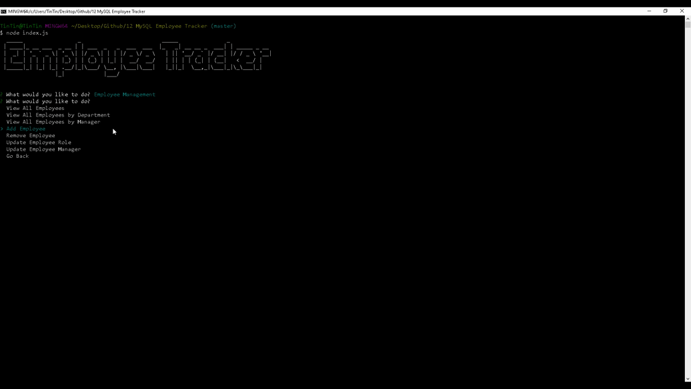
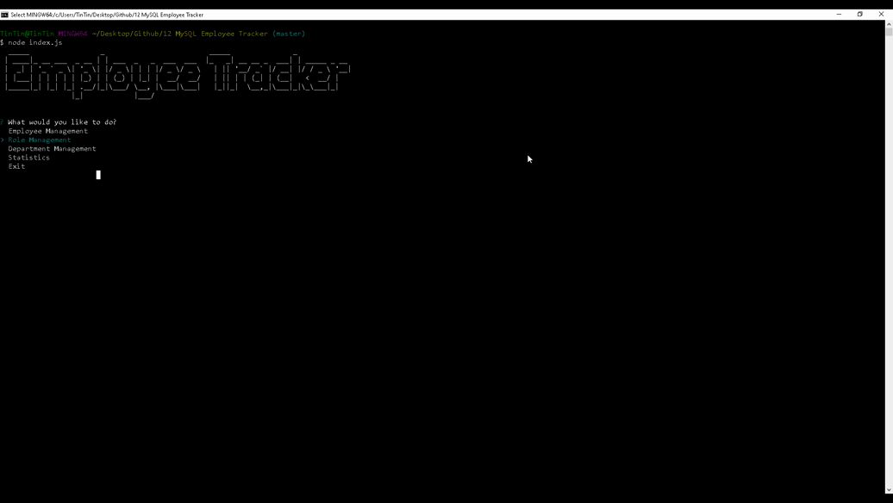
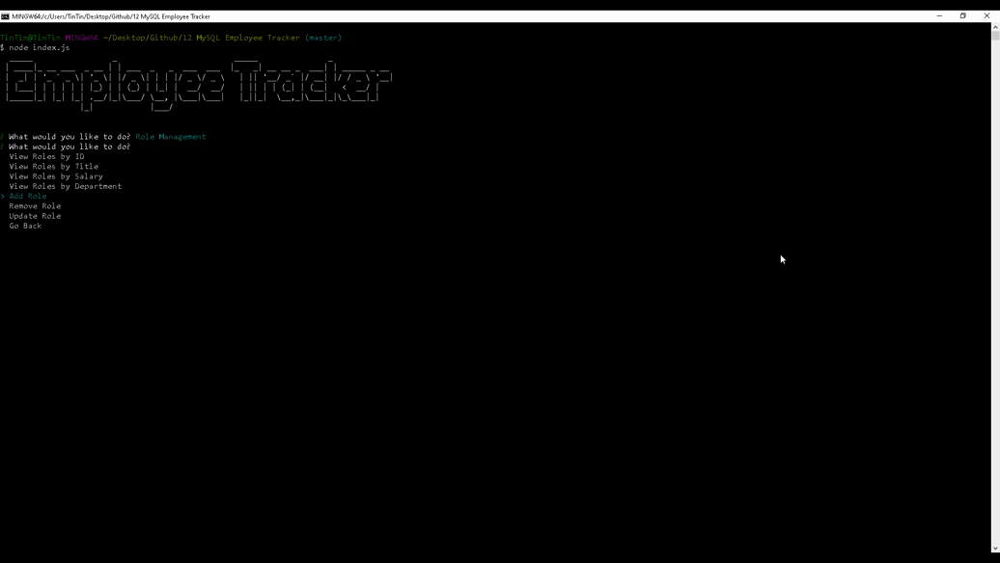
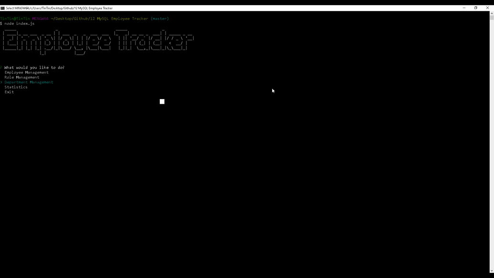
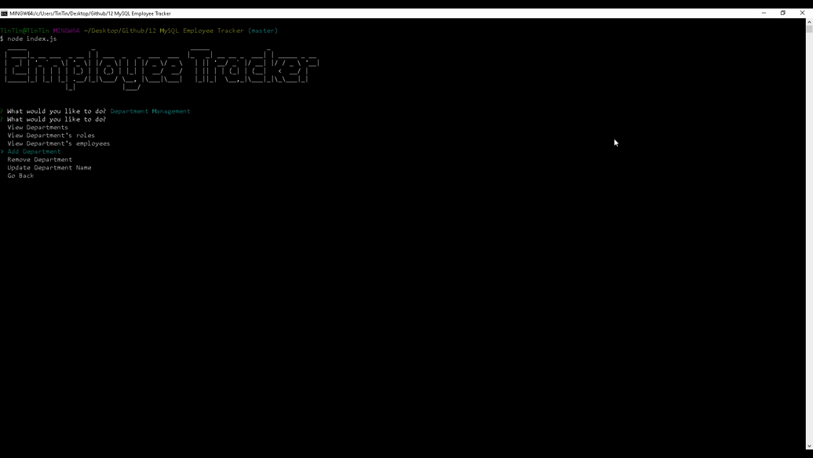
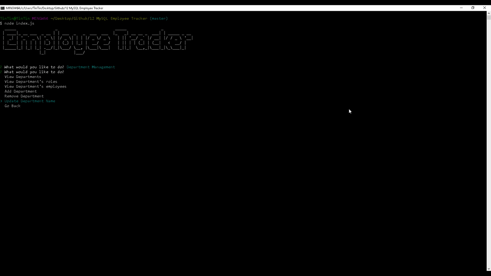

# Employee Tracker
[](https://opensource.org/licenses/MIT)
## Description
This is a **C**ontent **M**anagement **S**ystems focused-application for managing a company's employee database. It's built with a node interface and uses the inquirer npm package to communicate to a mysql backend. The results are then displayed using the console.table npm package. It has three major components (tables) in the database - Employees, Roles and Departments. Each management table consists of its own views, adding, removing and updating functions which the user has complete control over. The schema files in the sql folder can be consulted to find a detailed database structure. 
## Table of Contents
* [Installation](#Installation)
* [Configuration](#Configuration)
* [Usage](#Usage)
  * [Main](#Main)
  * [Employees](#Employees)
    * [View](#View)
    * [Add/Remove](#Add/Remove)
    * [Update](#Update)
  * [Roles](#Roles)
    * [View](#View)
    * [Add/Remove](#Add/Remove)
    * [Update](#Update)
  * [Departments](#Departments)
    * [View](#View)
    * [Add/Remove](#Add/Remove)
    * [Update](#Update)
* [License](#License)
* [Contributing](#Contributing)
* [Tests](#Tests)
* [Questions](#Questions)
## Installation
Download or clone the repo to a working director and extract its contents. Use a **C**ommand **L**ine **I**nterface to install necessary dependencies by running the following command:
```
npm i
```
To create the database, copy the contents from  and run it any application capable of managing MySQL database. MySQL Workbench was used for the development process. 
Sample data has also been provided in the  in the form of .csv files for populating your database and demo the app.
## Configuration
Locate the connection.js file inside the config folder and change the create connection function with your appropriate parameters.
## Usage 
Type the following in any CLI to run the app. 
```
node index.js
```
Each module's functions have also been demo-ed below.
### Main

### Employees
#### View

#### Add/Delete

#### Update

### Roles
#### View

#### Add/Delete

#### Update

### Departments
#### View

#### Add/Delete

#### Update

## License 
This project is licensed under the MIT License - see the [LICENSE.md](/LICENSE.md) file for details
## Contributing
Message the owner on github or by email. See [CONTRIBUTING.md](/Contributing.md)
## Questions 
If you have any questions about the repo, open an issue or contact me directly at shamik05@hotmail.com. You can find more of my work at [shamik05](https://github.com/shamik05/).
